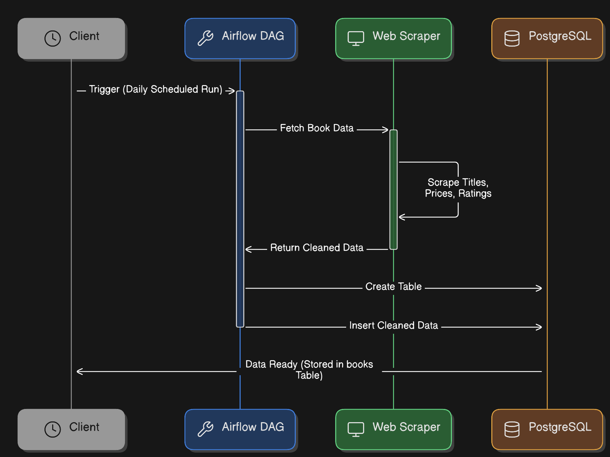
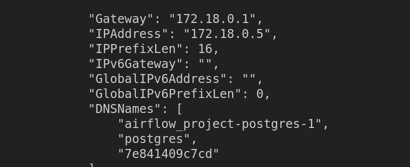

# Project: Orchestrated Book Scraper with PostgreSQL and Apache Airflow

## Description
This project demonstrates a complete ETL (Extract, Transform, Load) pipeline using Apache Airflow, PostgreSQL, and web scraping with Python. The workflow scrapes book data from a website, processes the data, and stores it in a PostgreSQL database using Airflow for orchestration.



## Features
- **Data Extraction**: Scrapes book data (title, price, and rating) from the "Books to Scrape" website.
- **Data Transformation**: Cleans and removes duplicate records.
- **Data Loading**: Stores the data in a PostgreSQL database.
- **Orchestration**: Airflow handles the workflow scheduling and dependencies.
- **Avoids Duplicate Entries**: Ensures no duplicate book titles are stored in the database using the `ON CONFLICT DO NOTHING` clause.
- **Daily Data Updates**: The DAG is scheduled to run daily, ensuring up-to-date book data.

## Prerequisites
- Docker and Docker Compose
- PgAdmin (optional, for PostgreSQL database management)

## Setup

### Step 1: Clone the Repository
```bash
git clone <repository_url>
cd <repository_directory>
```

### Step 2: Start Airflow and PostgreSQL Containers
Initialize Airflow:
```bash
docker compose up airflow-init
```

Start the services:
```bash
docker compose up
```

### Step 3: Configure PostgreSQL with PgAdmin
1. Access PgAdmin at `http://localhost:5050`
2. Log in using the credentials:
   - **Username**: admin@admin.com
   - **Password**: root

3. Create a server:


   - **Name**: `ps_db`
   - **Connection**: Use the details from inspecting the PostgreSQL container.

     ```bash
     docker inspect <container_id>
     ```
     
     
     Use the `IPAddress` value (e.g., `172.18.0.5`) and port `5432`.

   - **Username**: `airflow`
   - **Password**: `airflow`


4. Create a database named `books` within the server.

### Step 4: Set Up Airflow Connections
In the Airflow web UI:
1. Navigate to **Admin > Connections**.
2. Create a new connection:
   - **Connection ID**: `books_connection`
   - **Connection Type**: `Postgres`
   - **Host**: `172.18.0.5` (from Docker inspect)
   - **Schema**: `books`
   - **Login**: `airflow`
   - **Password**: `airflow`
   - **Port**: `5432`

  

### Step 5: Trigger the DAG
1. Access the Airflow UI at `http://localhost:8080`.
2. Enable the DAG named `fetch_and_store_books`.
3. Trigger the DAG manually or wait for the scheduled interval.

## DAG Workflow
1. **Fetch Book Data**: Scrapes book information from the "Books to Scrape" website.
2. **Create Table**: Ensures the `books` table exists in PostgreSQL.
3. **Insert Data**: Loads the scraped data into PostgreSQL while avoiding duplicate entries using the `ON CONFLICT DO NOTHING` clause.
  


## Project Files
- **`docker-compose.yml`**: Configures Airflow and PostgreSQL containers.
- **`dags/fetch_and_store_books.py`**: Defines the Airflow DAG and tasks.

## Troubleshooting
- If you encounter issues with container communication, ensure the IP address and credentials are correctly configured in both Airflow and PgAdmin.
- Use the Airflow and PostgreSQL container logs for debugging:
  ```bash
  docker logs <container_name>
  ```


